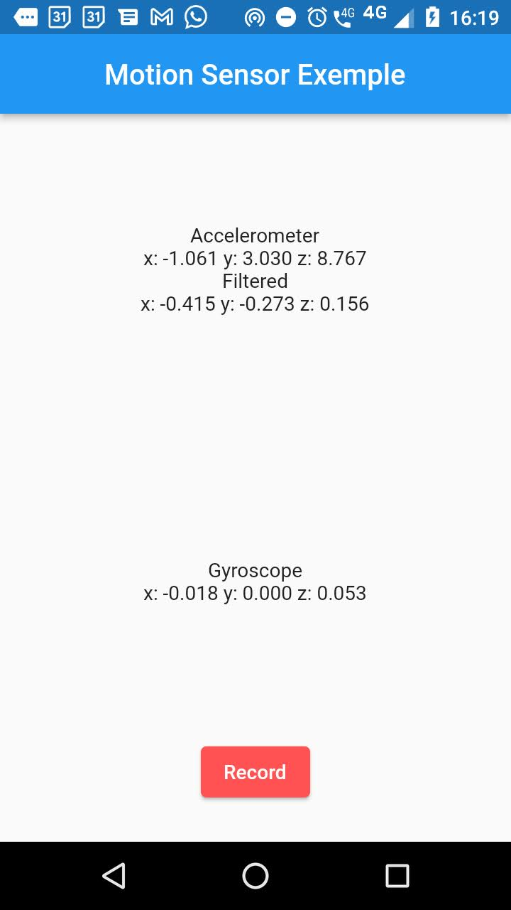

# motion_sensor_exemple

Aplicação Android usando flutter para recuperar valores do acelerômetro e giroscópio.
Esse exemplo é uma aplicação simples de utilização do package [sensors_plus](https://pub.dev/packages/sensors_plus)
para exibir os dados do acelerômetro e filtrar a gravidade por meio do filtro passa-alta.




Como toda aplicação flutter você pode usar as seguintes instruções executar a aplicação em modo debug:

```shell

flutter devices
# Exemplo de saída
"2 connected devices:

Moto E 4 Plus (mobile) • 0040122487 • android-arm • Android 7.1.1 (API 25)
Linux (desktop)        • linux      • linux-x64   • Arch Linux 5.16.2-arch1-1
"
# inicia o aplicação
flutter run --debug  -d "Moto E 4 Plus"
```